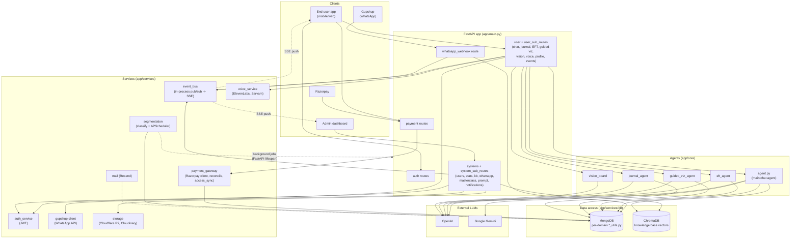
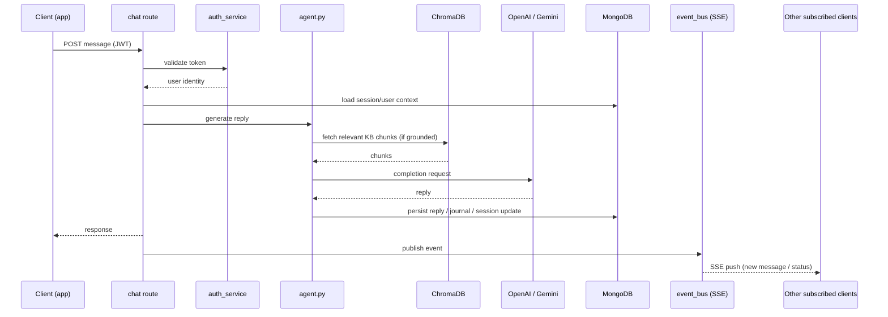
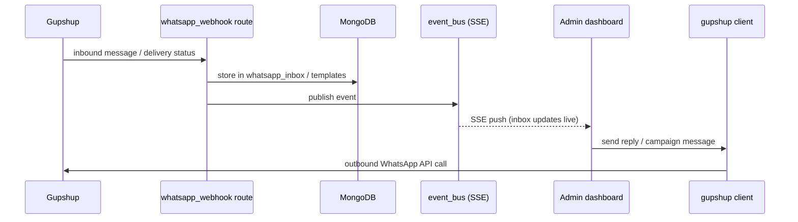
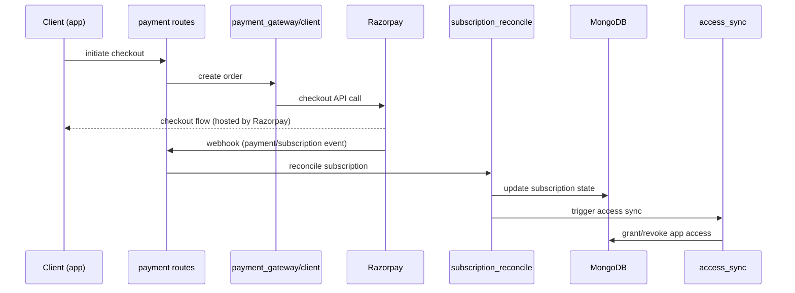
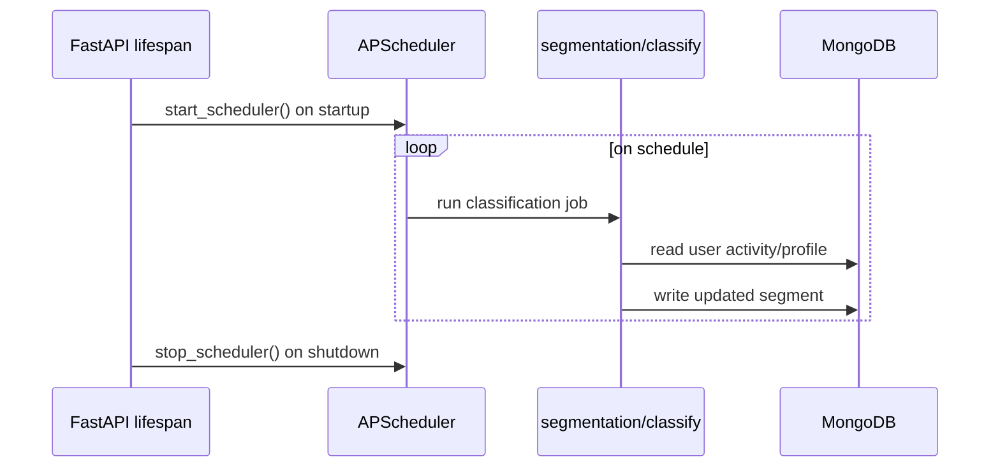

# System Architecture

## 1. Overview

Aura ("Sanaya Aura" / internally titled "Menifest my dreams - qlink") is the
backend for an AI companion app focused on emotional regulation and
manifestation practices. It's a FastAPI service that serves the end-user
mobile/web app (chat, journaling, guided visualization, EFT tapping, vision
boards, voice) and an internal admin dashboard (user management, WhatsApp
campaigns/inbox, knowledge base, masterclasses, subscriptions). It also
receives inbound webhooks from WhatsApp (via Gupshup) and Razorpay
(payments).

## 2. Components

- **API layer** (`app/routes/`) — FastAPI routers, split by audience:
  - `auth` — signup/login, Google OAuth, phone OTP
  - `user` + `user_sub_routes/` — chat, journal, EFT, guided visualization,
    vision board, voice, profile, masterclass, resources, notifications,
    SSE event stream (`events.py`)
  - `systems` + `system_sub_routes/` — admin-only: user management, stats,
    knowledge base (kb), WhatsApp campaigns/templates/inbox, masterclass
    and resource management, prompt management, notifications
  - `payment` — Razorpay checkout + subscription webhooks
  - `whatsapp_webhook` — inbound Gupshup webhook (messages, delivery
    status)
- **Agents** (`app/core/`) — the conversational/generative logic:
  - `agent.py` — the main chat agent and shared embedding helper
  - `eft_agent/`, `guided_viz_agent/`, `journal_agent/` — specialized
    conversational flows, each with its own prompt/utils module
  - `vision_board/` — vision board question flow and image-prompt
    generation
- **Services** (`app/services/`) — integration and cross-cutting logic:
  - `auth_service.py` — JWT issuing/validation (PyJWT)
  - `event_bus.py` — in-process async pub/sub used to push real-time
    updates (chat, WhatsApp inbox) to connected clients over SSE
  - `payment_gateway/` — Razorpay client, subscription reconciliation,
    access sync (granting/revoking app access based on subscription state)
  - `gupshup/` — WhatsApp Business API client and message lifecycle
    handling
  - `mail/` — transactional email via Resend
  - `voice_service/` — speech-to-text (ElevenLabs) and Sarvam AI voice
    integration
  - `storage/` — file storage on Cloudflare R2, plus Cloudinary for media
  - `segmentation/` — user classification logic and an APScheduler-driven
    background scheduler (started/stopped in the FastAPI `lifespan` hook)
- **Data access** (`app/services/db/`) — one `*_utils.py` module per
  domain (users, journal, EFT, guided viz, notifications, chat sessions,
  WhatsApp templates/campaigns/inbox, phone OTP, activity log, Razorpay
  records), all built on `mongo_utils.py`. Vector storage for
  retrieval-augmented generation lives under `db/chroma/` (ChromaDB —
  the knowledge-base upload/search path in `system_sub_routes/kb.py`
  reads and writes here). `pinecone_utils.py` implements an equivalent
  KB/journal-embedding interface but has no current importers in
  `app/routes` or `app/core` — treat it as legacy/inactive rather than a
  second live vector store.
- **Datastores**: MongoDB (primary datastore, via `pymongo`), ChromaDB
  (active vector store for the knowledge base).

## 3. Data flow

**Chat (main path):** client sends a message with a JWT →
`auth_service` validates the token → the relevant route in
`user_sub_routes/chat.py` loads session/user context from MongoDB →
`app/core/agent.py` (or a specialized agent for EFT/journal/guided-viz)
calls out to an LLM (OpenAI or Gemini) and, for knowledge-base-grounded
replies, fetches relevant chunks from ChromaDB → the reply and any
side-effects (journal entry, session update) are written back to MongoDB
→ the response is returned to the client, with real-time pushes (e.g. new
message, status update) fanned out to subscribed clients via
`event_bus.py` over SSE (`user_sub_routes/events.py`).

**WhatsApp:** Gupshup posts inbound messages/delivery events to
`whatsapp_webhook_router` → stored via `whatsapp_inbox_utils.py` /
`whatsapp_template_utils.py` in MongoDB → published on `event_bus` so the
admin dashboard's WhatsApp inbox updates live over SSE
(`system_sub_routes/whatsapp_inbox.py`). Outbound campaign sends go the
other direction: admin action → `gupshup` client → Gupshup API.

**Payments:** Razorpay checkout is initiated via `payment_gateway/client.py`;
Razorpay's webhook hits `payment` routes → `subscription_reconcile.py`
updates subscription state in MongoDB → `access_sync.py` grants/revokes
app access accordingly.

**Background jobs:** the FastAPI `lifespan` hook starts an APScheduler
instance (`segmentation/scheduler.py`) that periodically re-classifies
users (`segmentation/classify.py`) independent of any request.

## 4. External integrations & dependencies

- **LLMs**: OpenAI, Google Gemini (`google-genai`)
- **Vector store**: ChromaDB (active, knowledge base); Pinecone SDK is a
  dependency but its integration module is currently unused
- **Datastore**: MongoDB
- **Payments**: Razorpay (checkout + webhooks)
- **Messaging**: Gupshup (WhatsApp Business API — inbound webhook and
  outbound campaigns/replies)
- **Email**: Resend
- **Voice**: ElevenLabs (speech-to-text), Sarvam AI
- **Storage/media**: Cloudflare R2, Cloudinary
- **Auth**: Google OAuth (sign-in), PyJWT (session tokens), bcrypt/passlib
  (password hashing)

## 5. Tech stack

- **Language/runtime**: Python 3.10.13
- **Framework**: FastAPI on Uvicorn, ASGI lifespan used to start/stop the
  background scheduler and register the asyncio event loop with
  `event_bus`
- **Datastore**: MongoDB (via `pymongo`)
- **Background jobs**: APScheduler, in-process (no separate worker
  process/queue)
- **Containerization**: Docker (`Dockerfile`, `compose.yaml`,
  `docker-compose.yml`)
- **Real-time**: Server-Sent Events (`sse-starlette`) backed by an
  in-process pub/sub (`event_bus.py`) rather than an external broker

## 6. Key architectural decisions

- **Real-time updates use in-process SSE pub/sub, not an external message
  broker.** `event_bus.py` keeps subscriber queues in memory, keyed by
  user email, and requires the app's asyncio loop to be registered at
  startup. This is simple and sufficient for a single-instance deployment,
  but it means events don't fan out across multiple app instances/replicas
  — worth revisiting before horizontally scaling this service.
- **Background scheduling runs inside the API process.** `start_scheduler`/
  `stop_scheduler` are tied to the FastAPI lifespan, so segmentation jobs
  run in the same process serving requests rather than a separate worker.
  Simple to operate at current scale; a `--reload`/multi-worker deployment
  would need to guard against running the scheduler more than once.
- **Two vector-store integrations exist, only one is live.** ChromaDB
  backs the knowledge-base RAG path in production use; `pinecone_utils.py`
  implements an equivalent interface (including journal embeddings) but
  has no current callers. Anyone touching KB/RAG code should confirm
  which store is intended before extending either.
