# Database

Aura uses **MongoDB** (`db = mongo_client["aura"]`, defined in
`app/services/db/mongo_utils.py`) as its single primary datastore, plus a
separate **ChromaDB** vector collection for knowledge-base retrieval (see
[System Architecture §2](ARCHITECTURE.md#2-components)). There is no
formal schema enforcement (no Mongo JSON Schema validators) — the shapes
below are the de facto schema, inferred from what each `*_utils.py`
module actually reads/writes. All collections live in one database; there
is no per-feature database split.

## 1. Collections at a glance

```mermaid
erDiagram
    user_profile ||--o{ chat_sessions : "has"
    user_profile ||--o{ eft_sessions : "has"
    user_profile ||--o{ guided_viz_sessions : "has"
    user_profile ||--o{ journal_log : "has"
    user_profile ||--o{ activity_log : "has"
    user_profile ||--o{ notifications : "receives"
    user_profile ||--o{ payments : "makes"
    user_profile ||--o{ password_reset_tokens : "requests"
    user_profile ||--o{ phone_otps : "verifies via"
    whatsapp_conversations ||--o{ whatsapp_messages : "contains"
    whatsapp_campaigns ||--o{ whatsapp_campaign_messages : "sends"
    whatsapp_campaign_messages }o--|| whatsapp_template_media : "uses"

    user_profile {
        string email PK
        string username
        string phone
        string password
        bool is_paid
        string subscription_status
        string early_bird_sub_id
        int paid_until
        array chat_history
        string vision_board_url
    }
    chat_sessions {
        string session_id PK
        string email FK
        string title
        string source
        array messages
    }
    eft_sessions {
        string session_id PK
        string email FK
        array messages
        bool is_complete
        string audio_url
    }
    guided_viz_sessions {
        string session_id PK
        string email FK
        string user_message
        string theme
        string mood
        string script
        bool is_complete
    }
    journal_log {
        ObjectId _id PK
        string email FK
        string content
        int created_at
    }
    activity_log {
        string email FK
        string type
        string ref_id
        int created_at
    }
    notifications {
        string notification_id PK
        string email FK
        string type
        bool is_read
        datetime expires_at
    }
    payments {
        string payment_id PK
        string order_id
        string email FK
        int amount
        string status
        string event
    }
    password_reset_tokens {
        string token PK
        string email FK
        bool used
    }
    phone_otps {
        string email FK
        string phone
        string otp
        int attempts
        int expires_at
    }
    systems {
        string category PK
        string prompt
    }
    resources { }
    masterclass { }
    whatsapp_conversations {
        string _id PK "phone number"
        string contact_name
        int unread_count
        int last_message_at
    }
    whatsapp_messages {
        ObjectId _id PK
        string phone FK
        string direction
        string message_type
        string gupshup_message_id
        string status
    }
    whatsapp_campaigns {
        ObjectId _id PK
        string name
        string template_id
        string target
        string status
    }
    whatsapp_campaign_messages {
        ObjectId _id PK
        ObjectId campaign_id FK
        string phone
        string status
    }
    whatsapp_template_media {
        string template_id PK
        string media_type
        string media_url
    }
    webhook_events {
        string event_key PK
    }
```

## 2. Collection reference

Owning module = the `app/services/db/*_utils.py` file that is the only
code allowed to touch that collection directly (routes and agents go
through it rather than importing `db[...]` themselves).

| Collection | Owning module | Purpose |
|---|---|---|
| `user_profile` | `user_profile_utils.py` | One doc per user: identity, password hash, subscription/paid state, denormalized `chat_history`, vision board URL |
| `chat_sessions` | `chat_session_utils.py` | Main AI chat conversations, one doc per session, messages embedded as an array |
| `eft_sessions` | `eft_utils.py` | EFT (tapping) agent conversations, one doc per session |
| `guided_viz_sessions` | `guided_viz_utils.py` | Guided visualization sessions: prompt, generated script, mood/theme tags, audio output |
| `journal_log` | `journal_utils.py` | Journal entries, one doc per entry (not per session) |
| `activity_log` | `activity_log_utils.py` | Lightweight generic event log (`email`, `type`, `ref_id`, `created_at`) used mainly as an engagement signal for segmentation |
| `notifications` | `notification_utils.py` | In-app notifications; TTL index auto-expires docs 10 days after creation |
| `payments` | `razorpay_utils.py` | Append-only log of Razorpay payment/subscription webhook events |
| `password_reset_tokens` | `user_profile_utils.py` | Short-lived password reset tokens (1 hour expiry, enforced in application code, not a TTL index) |
| `phone_otps` | `phone_otp_utils.py` | WhatsApp OTP codes for phone verification, 5-minute expiry, capped retry attempts |
| `systems` | `mongo_utils.py` | Singleton-style config docs, keyed by `category` (currently just `system_prompt`) |
| `resources` | `system_sub_routes/resources.py` | Admin-managed content resources shown to users (videos/articles/etc.) |
| `masterclass` | `system_sub_routes/masterclass.py` | Admin-managed masterclass content |
| `whatsapp_conversations` | `whatsapp_inbox_utils.py` | One doc per phone number (`_id` = phone), rolling conversation summary (unread count, last message, 24h reply window) |
| `whatsapp_messages` | `whatsapp_inbox_utils.py` | Individual inbound/outbound WhatsApp messages; deduplicated on `gupshup_message_id` |
| `whatsapp_campaigns` | `whatsapp_campaign_utils.py` | Bulk WhatsApp template campaigns sent by admins |
| `whatsapp_campaign_messages` | `whatsapp_campaign_utils.py` | Per-recipient send status for a campaign |
| `whatsapp_template_media` | `whatsapp_template_utils.py` | Media (image/doc) attached to an approved WhatsApp template |
| `webhook_events` | `mongo_utils.py` | Idempotency guard — `event_key` is unique, checked before processing a webhook to reject duplicates |

## 3. Indexes

Explicitly created in `mongo_utils.py` and `notification_utils.py` (no
other collection has an application-defined index — Mongo's default `_id`
index is the only one elsewhere):

| Collection | Index | Type |
|---|---|---|
| `webhook_events` | `event_key` | unique |
| `whatsapp_messages` | `gupshup_message_id` | unique, sparse |
| `whatsapp_messages` | `(phone, created_at)` | compound, for conversation history queries |
| `notifications` | `expires_at` | TTL (`expireAfterSeconds=0`) |

Every other lookup (`user_profile` by `email`, `*_sessions` by
`session_id`, etc.) currently relies on a collection scan unless the
underlying field happens to be `_id`. Worth revisiting if any of these
collections grow large.

## 4. Vector store (ChromaDB)

Separate from MongoDB: knowledge-base documents are chunked, embedded,
and stored in ChromaDB (`app/services/db/chroma/`), keyed by a generated
`document_id` with `chunk_index`/`total_chunks`/`source` metadata (see
`system_sub_routes/kb.py`). This is the only vector store actually wired
into the app — see [ARCHITECTURE.md §6](ARCHITECTURE.md#6-key-architectural-decisions)
for the unused Pinecone integration living alongside it.

## 5. Notes & conventions

- **Timestamps** are stored as Unix epoch integers (`int(time.time())`)
  almost everywhere, not `Date`/ISO strings — the one exception is
  `notifications.expires_at`, which is a native Mongo `Date` because the
  TTL index requires it.
- **Session-style collections** (`chat_sessions`, `eft_sessions`,
  `guided_viz_sessions`) embed their message history as an array field
  on the session document rather than a separate messages collection —
  fine at current message volumes, but a doc-size ceiling (16MB) exists
  if a single session runs very long.
- **`email` is the de facto user foreign key** everywhere except
  WhatsApp collections, which key off `phone` instead — a user is only
  linked to their WhatsApp identity indirectly (see
  `_email_for_phone()` in `whatsapp_inbox_utils.py`).
- **No cross-collection transactions.** Multi-step writes (e.g. reconcile
  a subscription: update `payments` then `user_profile`) are done as
  sequential independent writes, not a Mongo multi-document transaction —
  acceptable for the current write patterns but worth knowing before
  adding logic that assumes atomicity across collections.

