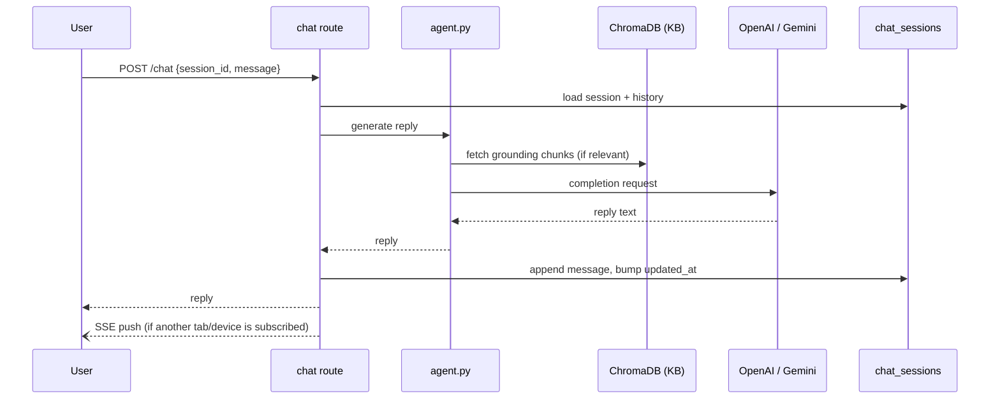

# Feature: Main Chat

The core conversational feature — a persistent, multi-session chat with
Aura's main agent. Each session is a separate thread (`chat_sessions`
collection) so a user can hold several parallel conversations; the agent
optionally grounds its replies in the admin-managed knowledge base.

**Endpoints** (`app/routes/user_sub_routes/chat.py`, `.../events.py`,
`app/routes/system_sub_routes/chat.py`):

| Method | Path | Purpose |
|---|---|---|
| POST | `/api/user/chat` | Send a message, get the agent's reply |
| POST | `/api/user/chat/session` | Start a new session |
| GET | `/api/user/chat/sessions` | List a user's sessions |
| GET | `/api/user/chat/session/{id}` | Fetch one session's messages |
| DELETE | `/api/user/chat/session/{id}` | Delete a session |
| GET | `/api/user/chat/ice-breakers` | Suggested opener prompts |
| GET | `/api/user/events` | SSE stream for real-time push |
| GET | `/api/system/chat/sessions[/​{id}]` | Admin: read-only view of any user's sessions |

**Data:** `chat_sessions` (session_id, email, title, source, messages[]) —
see [DATABASE.md](../DATABASE.md#2-collection-reference).

**Notes:** the main agent reads recent journal entries and long-term
memory as grounding context for its replies, but EFT, guided
visualization, and journaling are separate routes/agents a user enters
directly (not a mid-conversation handoff from this agent) — see
[other-features.md](other-features.md) for those.
