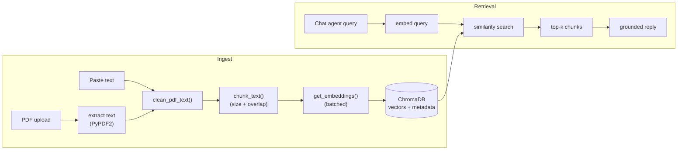

# Feature: Knowledge Base (RAG)

Admin-managed reference content that grounds the main chat agent's
replies. Admins upload PDFs or paste raw text; each document is chunked,
embedded, and stored in ChromaDB with shared metadata so every chunk
stays traceable back to its source document.

**Endpoints** (`app/routes/system_sub_routes/kb.py`, admin-only):

| Method | Path | Purpose |
|---|---|---|
| POST | `/api/system/kb/upload` | Upload a PDF, extract + chunk + embed its text |
| POST | `/api/system/kb/add-text` | Add raw text directly (no PDF) |
| GET | `/api/system/kb/all` | Paginated list/search across chunks |
| GET | `/api/system/kb/file-names` | Distinct source document names |
| GET | `/api/system/kb/id/{doc_id}` | Fetch one chunk |
| PUT | `/api/system/kb/update/{doc_id}` | Edit a chunk's text |
| DELETE | `/api/system/kb/delete/{doc_id}` | Remove a chunk |
| POST | `/api/system/kb/search` | Ad hoc similarity search (used to preview retrieval quality) |

**Data:** ChromaDB collection (not MongoDB) — one vector per chunk, with
`document_id` / `chunk_index` / `total_chunks` / `source` metadata. See
[ARCHITECTURE.md §6](../ARCHITECTURE.md#6-key-architectural-decisions)
for why ChromaDB (not the also-present Pinecone client) is the live
store.

**Notes:**
- Only PDF and manual-text ingestion are supported — no URL scraping or
  other file types.
- Chunking uses a fixed size + overlap (see `chunk_text()` in
  `db/chroma/utils.py`) rather than semantic/paragraph-aware splitting.
- `/kb/search` exists mainly as an admin debugging tool to sanity-check
  what the chat agent would retrieve for a given query, separate from
  the retrieval that happens automatically during chat (see
  [chat.md](chat.md)).
