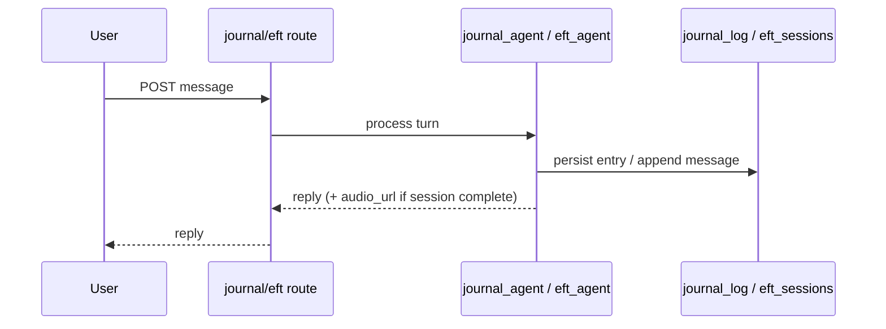
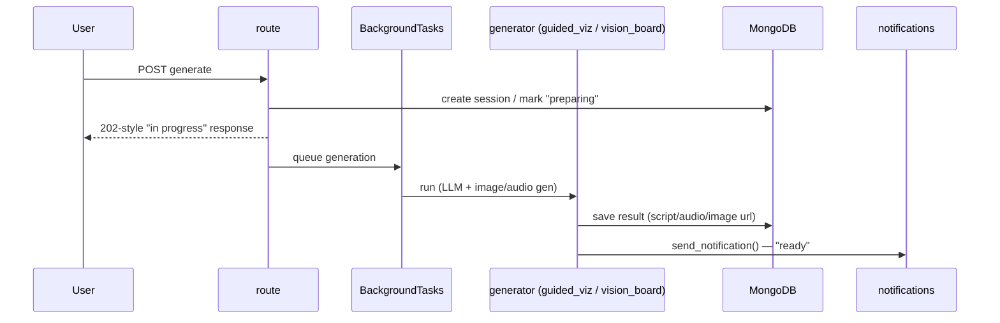

# Other Features

Smaller features grouped into one doc — each is simple enough on its own
not to warrant a separate file, but is documented here for completeness.
See [chat.md](chat.md), [whatsapp.md](whatsapp.md), [payments.md](payments.md),
and [knowledge_base.md](knowledge_base.md) for the features with enough
moving parts to deserve their own doc.

## Auth

Email/password, Google OAuth (both ID-token and auth-code flows), and
WhatsApp-delivered phone OTP for phone verification. JWTs are issued by
`auth_service.py` and required on nearly every other endpoint.

| Method | Path |
|---|---|
| POST | `/api/auth/register`, `/login` |
| POST | `/api/auth/google`, `/google/code` |
| POST | `/api/auth/check-user` |
| POST | `/api/auth/request-reset-password`, `/reset-password` |
| POST | `/api/auth/phone/send-otp`, `/phone/verify-otp` |

## Journal & EFT (synchronous agents)

Both are single-request conversational agents: the user sends a message,
the agent replies immediately in the same response (no polling).
- **Journal** (`journal_agent.py`) — reflective prompts + free-form
  entries, stored per-entry in `journal_log` and also embedded into the
  vector store for the main chat agent's long-term memory.
- **EFT** (`eft_agent.py`) — guided EFT ("tapping") conversations, stored
  per-session in `eft_sessions`; a session can end with a generated
  `audio_url`.

## Guided Visualization & Vision Board (async generation)

Both are slow, generative flows kicked off as a FastAPI background task:
the request returns immediately with an "in progress" status, and the
user is notified (via the notifications system) once the asset is ready.
- **Guided Visualization** (`guided_viz_agent.py`) — generates a themed
  visualization script + narrated audio, stored in `guided_viz_sessions`.
- **Vision Board** (`vision_board/genrate_vision_board.py`) — takes
  answers to `VISION_QUESTIONS` + a chosen vibe, generates a board image,
  and stores its URL on `user_profile.vision_board_url`.

## Voice

`POST /api/user/voice-to-text` — uploads an audio file (≤10MB, whitelisted
content-types), transcribes it via ElevenLabs STT
(`voice_service/elevenlabs_stt.py`), returns the transcript. Stateless —
no session or DB write of its own; the transcript is fed back in as a
regular chat/journal/EFT message by the client.

## Notifications

In-app notifications with a 10-day TTL (`notifications` collection).
Written by other features (masterclass publish, guided-viz/vision-board
completion, admin broadcast) via `send_notification()`, read by the user
via:

| Method | Path |
|---|---|
| GET | `/api/user/notifications` |
| GET | `/api/user/notifications/unread-count` |
| POST | `/api/user/notifications/{id}/read`, `/read-all` |
| POST | `/api/system/notifications/send` (admin broadcast) |

Five of those moments are also mirrored to WhatsApp
(`gupshup/notifications.py`), for users who verified a phone number —
guided viz ready, EFT session ready, vision board ready, new masterclass,
new resource. See [whatsapp.md](whatsapp.md#notification-templates); the
in-app notification is unaffected by whether the WhatsApp send succeeds.

## Masterclass & Resources

Admin-managed content shown to users — a single "current masterclass"
document plus a general resources library (videos/articles/etc., with
Cloudflare R2-backed thumbnail/presigned-URL upload). Publishing a new
masterclass sends a notification to users via the same `event_bus` /
`send_notification()` path described above.

| Area | Method | Path |
|---|---|---|
| Masterclass (admin) | GET/PUT/DELETE | `/api/system/masterclass` |
| Masterclass (user) | GET | `/api/user/masterclass` |
| Resources (admin) | GET/POST/PUT/DELETE | `/api/system/resources[/​{id}]` |
| Resources (admin) | POST | `/api/system/resources/thumbnail`, `/presigned-url` |
| Resources (user) | GET | `/api/user/resources[/​{id}]` |

## Segmentation (background job)

Not user-facing — a daily 3am job (`segmentation/scheduler.py`, via
APScheduler) that recomputes each user's engagement tier
(`inactive`/`low`/`medium`/`high`/`daily`, based on distinct active days
across chat/EFT/guided-viz/journal/activity logs) and funnel status
(`cold`/`warm`/`hot`/`converted`). The same scheduler also syncs
subscription access daily and runs any due scheduled WhatsApp campaigns
every minute — see [whatsapp.md](whatsapp.md) and
[ARCHITECTURE.md §3](../ARCHITECTURE.md#3-data-flow) for the "Background
jobs" flow diagram.

