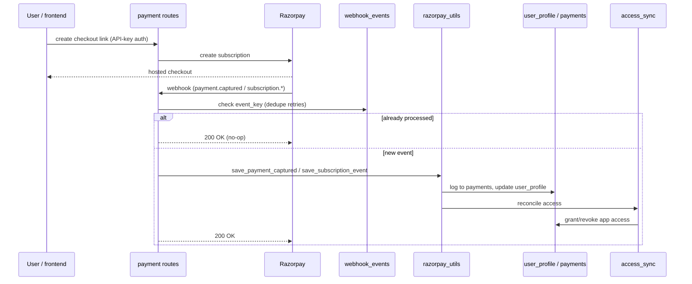

# Feature: Payments & Subscriptions

Subscription billing via Razorpay. All subscription-mutating endpoints
(except the webhook) are server-to-server only, gated by a static
`X-API-Key` header (`admin_api_key`) rather than end-user JWT auth — the
calling frontend/backoffice is trusted to have already authenticated the
user.

**Endpoints** (`app/routes/payment.py`):

| Method | Path | Purpose |
|---|---|---|
| POST | `/api/payment/early-bird-subscription` | Create a discounted "early bird" subscription link |
| POST | `/api/payment/subscribe` | Create a standard subscription link |
| GET | `/api/payment/subscription` | Read a user's current subscription state |
| POST | `/api/payment/cancel-subscription` | Cancel (immediately or at cycle end) |
| POST | `/api/payment/pause-subscription` | Pause billing |
| POST | `/api/payment/activate-free-plan` | Grant free-tier access without payment |
| POST | `/api/payment/webhook` | Razorpay's server-to-server event notifications |

**Data:** `payments` (append-only event log), `user_profile` fields
`is_paid` / `subscription_status` / `early_bird_sub_id` / `paid_until`,
`webhook_events` (idempotency) — see
[DATABASE.md](../DATABASE.md#2-collection-reference).

**Notes:**
- Webhook signature is verified via HMAC-SHA256 against
  `razorpay_webhook_secret` before anything else runs
  (`_verify_signature` in `payment.py`).
- `_webhook_event_key()` builds the idempotency key from
  `event:object_id:created_at` — Razorpay redelivers the identical
  payload on retry, so this triple is stable across retries but distinct
  across genuinely new events.
- A `payment.captured` event triggers a live re-fetch of subscription
  status from Razorpay (`_reconcile_subscription_from_invoice`) rather
  than trusting a possibly-stale `subscription_status` already on the
  profile — guards against a capture arriving after a stale/superseded
  `subscription.cancelled` webhook.

