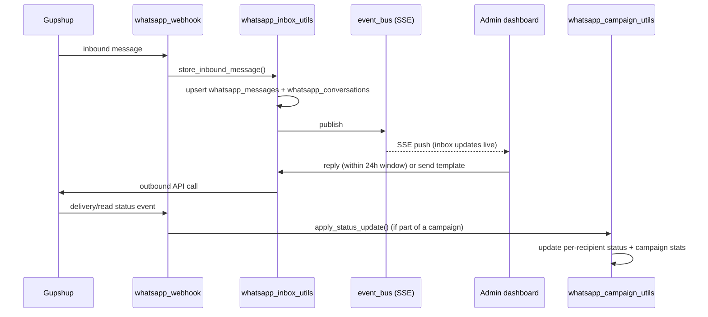

# Feature: WhatsApp (Inbox, Campaigns, Templates)

Admin-facing WhatsApp Business messaging via Gupshup, covering three
related but distinct capabilities:

1. **Inbox** — a live, two-way conversation view per phone number. Admins
   can free-reply within WhatsApp's 24-hour window, or fall back to an
   approved template outside it.
2. **Campaigns** — bulk sends of an approved template to a target segment
   or manual number list.
3. **Templates** — CRUD for the approved WhatsApp message templates
   (including attached media) that both inbox fallback replies and
   campaigns draw from.
4. **Notifications** — the automatic, non-admin-triggered sends: the
   WhatsApp mirror of five in-app notifications (see below).

Also included: `whatsapp_webhook.py` — the single inbound endpoint
Gupshup posts every event to (messages, delivery/read statuses),
regardless of whether it's part of a 1:1 conversation or a campaign send.

**Endpoints:**

| Area | Method | Path |
|---|---|---|
| Inbox | GET | `/api/system/whatsapp/inbox/events` (SSE) |
| Inbox | GET | `/api/system/whatsapp/inbox/conversations` |
| Inbox | GET | `/api/system/whatsapp/inbox/conversations/{phone}/messages` |
| Inbox | POST | `/api/system/whatsapp/inbox/conversations/{phone}/read` |
| Inbox | POST | `/api/system/whatsapp/inbox/conversations/{phone}/reply` |
| Templates | POST/GET/PUT/DELETE | `/api/system/whatsapp/templates[/​{id}]` |
| Templates | POST | `/api/system/whatsapp/templates/media` |
| Campaigns | GET | `/api/system/whatsapp/campaigns/personalization-fields` |
| Campaigns | POST/GET | `/api/system/whatsapp/campaigns` |
| Campaigns | GET | `/api/system/whatsapp/campaigns/{id}[/contacts]` |
| Campaigns | DELETE | `/api/system/whatsapp/campaigns/{id}` |
| Campaigns | POST | `/api/system/whatsapp/campaigns/{id}/retry` |
| Webhook | POST | `/api/whatsapp/webhook` |
| User-side | POST | `/api/auth/phone/send-otp`, `/phone/verify-otp` (also routed through Gupshup) |

**Data:** `whatsapp_conversations`, `whatsapp_messages`,
`whatsapp_campaigns`, `whatsapp_campaign_messages`,
`whatsapp_template_media` — see
[DATABASE.md](../DATABASE.md#2-collection-reference).

## Notification templates

`gupshup/notifications.py` mirrors five in-app notifications to WhatsApp,
so a user who isn't in the web app still hears about them. All five are
UTILITY-category templates, which is what lets them reach any verified
number without a marketing opt-in.

| Moment | Template | Fired from | Audience |
|---|---|---|---|
| Guided viz ready | `aura_visualisation_ready` | `guided_viz_agent` (background task) | that user |
| EFT session ready | `aura_eft_ready` | `eft_agent` | that user |
| Vision board ready | `aura_vision_board_ready` | `vision_board/genrate_vision_board` (background task) | that user |
| New masterclass | `aura_new_masterclass` | `PUT /api/system/masterclass` | everyone with a phone |
| New resource live | `aura_resource_added` | `POST /api/system/resources` | everyone with a phone |

- Three of the buttons deep-link to the exact thing the message is about
  — `?session=<id>` for guided viz and EFT, `?resource=<id>` for a
  resource — through a variable at the tail of the button URL. Meta
  numbers button variables separately from body ones (both start at
  `{{1}}`), but the send API takes a single flat params list: body
  variables first, button variables last. `aura_resource_added` therefore
  sends `[name, category_label, resource_name, resource_id]`. Vision
  board and masterclass need no id — there's only ever one of each per
  user — so their buttons are static URLs.
- Element names and languages are inconsistent across the five, and it's
  an accident of Meta's locking rather than a decision. Deleting a
  template blocks that name for up to four weeks across *both* English
  variants, so the three deep-link ones were resubmitted under new names
  (`aura_visualisation_ready`, `aura_resource_added`) and `en_GB`, while
  the two that were never corrected kept their original names under
  `en_US`. EFT is the odd one: `aura_eft_ready` came back from its delete
  and got approved, so it's the one in use, and the `aura_tapping_ready`
  submitted to replace it is a harmless unused twin. Nothing reads the
  name or language at send time — the sender addresses templates by id —
  so the only cost is that an element name no longer obviously matches
  its `WA_TEMPLATE_*` variable.
- Template ids come from env (`WA_TEMPLATE_*`) because Meta only issues
  them on approval. An unset id skips that WhatsApp send and logs a
  warning — the in-app notification is unaffected either way. Submit the
  templates with `python -m scripts.create_whatsapp_notification_templates`.
- The two broadcasts run through `whatsapp_campaign_utils` rather than a
  loop of their own, so an automatic send gets the same per-recipient
  delivery tracking, outage abort and dashboard retry as a hand-built
  campaign. They show up in the campaigns list named `Auto · …`.
- A masterclass broadcast only fires when the masterclass is new,
  retitled, or rescheduled — editing the meeting link or password does
  not re-notify (unlike the in-app notification, which still fires on
  every `PUT`).

**Notes:**
- The inbox and campaigns share the same underlying Gupshup client and
  the same `whatsapp_messages`/status-event handling, but inbox replies
  are ad hoc 1:1 while campaigns are scheduled/bulk — don't conflate
  "sending a WhatsApp message" as one code path, there are two senders
  (`whatsapp_inbox_utils.send_reply` vs `whatsapp_campaign_utils`).
- `webhook_events` (unique on `event_key`) guards the payment webhook
  against duplicate delivery; the WhatsApp webhook instead de-duplicates
  messages via the unique/sparse index on `whatsapp_messages.gupshup_message_id`.

