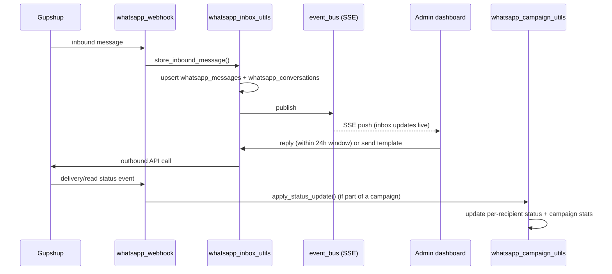

# Feature: WhatsApp (Inbox, Campaigns, Templates)

Admin-facing WhatsApp Business messaging via Gupshup, covering three
related but distinct capabilities:

1. **Inbox** — a live, two-way conversation view per phone number. Admins
   can free-reply within WhatsApp's 24-hour window, or fall back to an
   approved template outside it.
2. **Campaigns** — bulk sends of an approved template to a target segment
   or manual number list.
3. **Templates** — CRUD for the approved WhatsApp message templates
   (including attached media) that both inbox fallback replies and
   campaigns draw from.

Also included: `whatsapp_webhook.py` — the single inbound endpoint
Gupshup posts every event to (messages, delivery/read statuses),
regardless of whether it's part of a 1:1 conversation or a campaign send.

**Endpoints:**

| Area | Method | Path |
|---|---|---|
| Inbox | GET | `/api/system/whatsapp/inbox/events` (SSE) |
| Inbox | GET | `/api/system/whatsapp/inbox/conversations` |
| Inbox | GET | `/api/system/whatsapp/inbox/conversations/{phone}/messages` |
| Inbox | POST | `/api/system/whatsapp/inbox/conversations/{phone}/read` |
| Inbox | POST | `/api/system/whatsapp/inbox/conversations/{phone}/reply` |
| Templates | POST/GET/PUT/DELETE | `/api/system/whatsapp/templates[/​{id}]` |
| Templates | POST | `/api/system/whatsapp/templates/media` |
| Campaigns | GET | `/api/system/whatsapp/campaigns/personalization-fields` |
| Campaigns | POST/GET | `/api/system/whatsapp/campaigns` |
| Campaigns | GET | `/api/system/whatsapp/campaigns/{id}[/contacts]` |
| Campaigns | DELETE | `/api/system/whatsapp/campaigns/{id}` |
| Campaigns | POST | `/api/system/whatsapp/campaigns/{id}/retry` |
| Webhook | POST | `/api/whatsapp/webhook` |
| User-side | POST | `/api/auth/phone/send-otp`, `/phone/verify-otp` (also routed through Gupshup) |

**Data:** `whatsapp_conversations`, `whatsapp_messages`,
`whatsapp_campaigns`, `whatsapp_campaign_messages`,
`whatsapp_template_media` — see
[DATABASE.md](../DATABASE.md#2-collection-reference).

**Notes:**
- The inbox and campaigns share the same underlying Gupshup client and
  the same `whatsapp_messages`/status-event handling, but inbox replies
  are ad hoc 1:1 while campaigns are scheduled/bulk — don't conflate
  "sending a WhatsApp message" as one code path, there are two senders
  (`whatsapp_inbox_utils.send_reply` vs `whatsapp_campaign_utils`).
- `webhook_events` (unique on `event_key`) guards the payment webhook
  against duplicate delivery; the WhatsApp webhook instead de-duplicates
  messages via the unique/sparse index on `whatsapp_messages.gupshup_message_id`.
